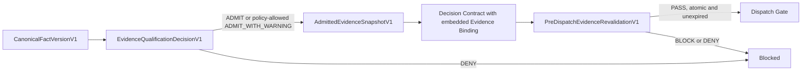

# IDR V1.4 Minimal Evidence Governance Specification

- Status: **Specification Only**
- Version: `1.0-draft`
- Date: 2026-08-02
- Production implementation: **Not authorized**

Normative terms `MUST`, `MUST NOT`, `SHOULD`, and `MAY` have their usual
requirements meaning. This document defines contract boundaries and
invariants only. It does not authorize runtime, storage, migration, or product
implementation.

## 1. Version boundary

IDR V1.3 Round 14 is the frozen audit baseline. Its Rust, TypeScript, Python,
PostgreSQL, and Aegis runtime code is outside the V1.4 change surface and MUST
NOT be modified to implement this specification.

IDR V1.4 Minimal defines only this evidence-governance loop:

```text
CanonicalFactVersionV1
→ EvidenceQualificationDecisionV1
→ AdmittedEvidenceSnapshotV1
→ Decision Contract Binding
→ Pre-dispatch Revalidation
```

The following are explicitly outside this version:

- Setoka integration;
- personality inference or broad psychological profiling;
- vector databases or vector retrieval;
- graph memory;
- bitemporal semantic retrieval;
- Human Model features;
- database migrations;
- production code or production enablement.

This specification does not change the V1.3 production latch:

```text
V1.3 = Frozen Audit Baseline / Production Disabled
V1.4 Minimal = Specification Only
```

## 2. Closed-loop invariant



The governing invariant is:

> A Decision Contract that depends on evidence MUST bind one exact, sealed
> AdmittedEvidenceSnapshotV1. Dispatch MUST re-read the current authority
> state and revalidate that same Decision revision and Snapshot immediately
> before the dispatch transition. Raw facts, a newer snapshot, or a client
> reconstruction are not substitutes.

No object in the loop grants action authorization by itself. Existing action,
authorization, permit, lease, nonce, owner, provider, and dispatch controls
remain independent mandatory gates.

## 3. Normative wire primitives and budgets

All five boundaries use the same primitives.

| Primitive | Constraint |
| --- | --- |
| `SchemaId` | Lowercase ASCII identifier, 1–96 bytes, pattern `^[a-z0-9][a-z0-9._-]*$`. |
| `Uuid` | Canonical lowercase RFC 4122 hyphenated string. Nil UUID is forbidden. |
| `WireU64` | JSON integer in `0..=9_007_199_254_740_991`; counters and versions that identify a published object start at 1. |
| `TimestampMs` | `WireU64` milliseconds since Unix epoch. It is a verification timestamp, not a bitemporal query dimension. |
| `Sha256Digest` | Exactly 64 lowercase hexadecimal characters. |
| `ReasonCode` | Uppercase ASCII identifier, 1–64 bytes, pattern `^[A-Z][A-Z0-9_]*$`. |
| `BoundedText` | UTF-8 NFC, no control characters except tab/newline where a field explicitly permits them. |
| `CanonicalJsonValue` | `null`, boolean, string, safe integer, array, or object. Floating-point numbers, duplicate keys, non-NFC strings, and unknown object fields are forbidden. Decimal domain values use a separately constrained string form. |

Unless a field states a smaller limit:

- one contract is at most 256 KiB after canonical serialization;
- nesting depth is at most 32;
- total JSON nodes are at most 4,096;
- one array contains at most 256 entries;
- one string contains at most 16 KiB;
- maps reject duplicate keys after NFC normalization;
- parsers MUST reject unknown fields and MUST NOT silently coerce types;
- optional fields are omitted, not encoded as `null`, unless `null` is part of
  the declared field type.

### 3.1 ExactVersionRefV1

Every cross-object reference is exact:

| Field | Type | Constraint |
| --- | --- | --- |
| `kind` | `SchemaId` | Expected contract kind; cross-kind substitution is forbidden. |
| `id` | `Uuid` | Stable object identity. |
| `version` | `WireU64` | Exact immutable version or revision, at least 1. |
| `digest` | `Sha256Digest` | Digest of that exact version. |

An ID without version and digest is never sufficient for qualification,
snapshot inclusion, Decision binding, or dispatch revalidation.

### 3.2 ExactPolicyRefV1

Qualification and warning behavior bind an exact policy:

| Field | Type | Constraint |
| --- | --- | --- |
| `policy_id` | `Uuid` | Non-nil policy identity. |
| `policy_revision` | `WireU64` | Exact revision, at least 1. |
| `policy_digest` | `Sha256Digest` | Digest of the exact policy content. |

The policy authority, policy storage, and policy distribution protocol are
unresolved implementation concerns. A missing, unknown, revoked, or
superseded policy is fail-closed.

## 4. State and decision enumerations

### 4.1 FactLifecycleStateV1

```text
ACTIVE
SUPERSEDED
REVOKED
INVALIDATED
```

- Only `ACTIVE` can qualify.
- `SUPERSEDED`, `REVOKED`, and `INVALIDATED` are terminal for that exact fact
  version.
- A correction creates a new fact version; it never restores or mutates the
  old version.

### 4.2 QualificationVerdictV1

```text
ADMIT
ADMIT_WITH_WARNING
DENY
```

- `ADMIT`: all mandatory checks are known and pass; no active warning exists.
- `ADMIT_WITH_WARNING`: all hard checks pass, every warning code is explicitly
  allowed by the exact policy, and every required follow-up is represented.
- `DENY`: a hard check fails, a required result is unknown, a warning is not
  policy-allowed, or a blocking follow-up is unsatisfied.

`ADMIT_WITH_WARNING` is not a softer spelling of `DENY`. Invalid provenance,
broken lineage, stale safety-critical evidence, prohibited inference, digest
mismatch, revocation, or supersession can never be converted into a warning.

### 4.3 RequiredEvidenceActionKindV1

```text
REFRESH
CORROBORATE
SOURCE_REPAIR
HUMAN_REVIEW
```

These are remediation requirements, not execution permissions.

### 4.4 Assessment states

```text
FreshnessAssessmentV1  = FRESH | NEAR_EXPIRY | STALE | UNKNOWN
LineageAssessmentV1    = VALID | BROKEN | CYCLIC | UNKNOWN
ProvenanceAssessmentV1 = VERIFIED | PARTIAL | INVALID | UNKNOWN
SupersessionAssessmentV1 = CURRENT | SUPERSEDED | REVOKED | CONFLICT | UNKNOWN
```

`UNKNOWN` is never implicitly positive. A policy MAY allow `NEAR_EXPIRY` or
`PARTIAL` only as an explicit, non-material warning. It MUST NOT allow
`STALE`, `INVALID`, `BROKEN`, `CYCLIC`, `SUPERSEDED`, or `REVOKED` into an
admitted snapshot.

### 4.5 SnapshotLifecycleStateV1

```text
SEALED
SUPERSEDED
EXPIRED
INVALIDATED
```

Only `SEALED` and currently unexpired snapshots can bind a new Decision.
Published snapshot content is immutable.

### 4.6 BindingLifecycleStateV1

```text
BOUND
INVALIDATED
```

The effective state is derived from the exact Decision revision, snapshot,
policy, and their current upstream states. `INVALIDATED` never transitions
back to `BOUND`; remediation produces a new snapshot and Decision revision.

### 4.7 PreDispatchRevalidationResultV1

```text
PASS
BLOCK
DENY
```

- `PASS` is short-lived, single-use, and contains no unsatisfied remediation.
- `BLOCK` identifies one or more remediable actions and prevents dispatch.
- `DENY` identifies a terminal or prohibited condition and prevents dispatch.

## 5. Source evidence reference

`SourceEvidenceRefV1` is embedded in a fact. It is not a sixth authority
contract in this Minimal loop; it is the exact provenance reference required
to qualify the fact.

| Field | Type | Constraint |
| --- | --- | --- |
| `source_evidence_ref` | `ExactVersionRefV1` | `kind` identifies the source evidence class. |
| `tenant_id` | `Uuid` | MUST equal the enclosing fact tenant. |
| `subject_ref` | `ExactVersionRefV1` | Exact source subject; MUST be compatible with the fact subject. |
| `issuer_id` | `Uuid` | Exact issuer identity. |
| `source_class` | enum | `PRIMARY`, `SECONDARY`, `HUMAN_ATTESTATION`, `SENSOR`, or `SYSTEM_RECORD`. |
| `scope` | `SchemaId` | Scope under which the evidence may be used. |
| `purpose` | `SchemaId` | Purpose for which the evidence was collected. |
| `content_digest` | `Sha256Digest` | Digest of the source bytes or canonical source payload. |
| `collection_method_id` | `SchemaId` | Named collection method. |
| `collection_method_revision` | `WireU64` | Exact method revision. |
| `observed_at_ms` | `TimestampMs` | When the source observation occurred. |
| `issued_at_ms` | `TimestampMs` | MUST be at or after observation within allowed skew. |
| `expires_at_ms` | `TimestampMs`, optional | If present, MUST be greater than `issued_at_ms`. |
| `proof_ref` | `ExactVersionRefV1`, optional | Signature, attestation, or authenticated transport proof. |

Qualification MUST verify tenant, subject, issuer, scope, purpose, content
digest, collection method, time bounds, current revocation state, and proof
binding. A URL, source name, model citation, or human-readable note alone is
not provenance.

## 6. CanonicalFactVersionV1

### 6.1 Purpose

`CanonicalFactVersionV1` is one immutable, typed assertion version. It is not
an inference profile, memory node, search result, or mutable “latest fact”.

### 6.2 Schema

| Field | Type | Constraint |
| --- | --- | --- |
| `schema_id` | `SchemaId` | Constant `idr.canonical_fact_version.v1`. |
| `schema_version` | `WireU64` | Constant `1`. |
| `fact_id` | `Uuid` | Stable identity across versions of the same fact. |
| `fact_version` | `WireU64` | Starts at 1 and increments contiguously. |
| `tenant_id` | `Uuid` | Tenant boundary for every nested reference. |
| `subject_ref` | `ExactVersionRefV1` | Exact subject of the assertion. |
| `predicate` | `SchemaId` | Typed, policy-allowlisted predicate. Broad personality predicates are forbidden. |
| `canonical_value` | `CanonicalJsonValue` | Typed value under the predicate schema and common budgets. |
| `value_digest` | `Sha256Digest` | Digest of the canonical value with the value domain separator. |
| `source_evidence` | array of `SourceEvidenceRefV1` | 1–64 unique exact references, deterministically sorted. |
| `lineage` | `FactLineageV1` | Direct or derived lineage as defined below. |
| `previous_version_ref` | `ExactVersionRefV1`, optional | Required for version > 1; MUST identify version - 1 of the same `fact_id`. |
| `supersession_reason` | enum, optional | Required with `previous_version_ref`: `REFRESH`, `CORRECTION`, `SOURCE_REPAIR`, or `REVOCATION_RESPONSE`. |
| `issued_at_ms` | `TimestampMs` | Trusted issuance time. |
| `expires_at_ms` | `TimestampMs`, optional | MUST be greater than `issued_at_ms`. |
| `status_at_issue` | `FactLifecycleStateV1` | MUST equal `ACTIVE` for a newly published fact. |
| `fact_digest` | `Sha256Digest` | Digest defined in section 11; excluded from its own preimage. |

### 6.3 FactLineageV1

| Field | Type | Constraint |
| --- | --- | --- |
| `lineage_kind` | enum | `DIRECT` or `DERIVED`. |
| `parent_fact_refs` | array of `ExactVersionRefV1` | Empty for `DIRECT`; 1–64 unique refs for `DERIVED`. |
| `transform_ref` | `ExactVersionRefV1`, optional | Forbidden for `DIRECT`; required for `DERIVED`. |
| `parameters_digest` | `Sha256Digest`, optional | Forbidden for `DIRECT`; required for `DERIVED`. |

For `DERIVED`, every parent MUST be exact, current, tenant-compatible, and
admissible under the same or a stricter policy. The transform MUST be
deterministic and versioned. Lineage cycles, missing parents, duplicate
parents, an unversioned transform, or an unverifiable parameters digest are
hard denials.

### 6.4 Fact rules

1. `(fact_id, fact_version)` has exactly one content digest; forks are invalid.
2. Version 1 has no predecessor. Version N > 1 binds version N - 1 exactly.
3. A newer version is not automatically true or admitted. It undergoes a new
   qualification.
4. Independent contradictory sources use distinct fact identities and enter
   corroboration/conflict handling. They MUST NOT impersonate supersession.
5. Supersession never edits an existing snapshot. It invalidates downstream
   use and requires a new fact qualification, snapshot, and Decision revision.
6. The current effective lifecycle state MUST be read from the authoritative
   append-only state projection at qualification and again at pre-dispatch.

## 7. EvidenceQualificationDecisionV1

### 7.1 Purpose

This object records a deterministic policy decision over one exact fact
version and the current status of all required provenance and lineage.

### 7.2 Schema

| Field | Type | Constraint |
| --- | --- | --- |
| `schema_id` | `SchemaId` | Constant `idr.evidence_qualification_decision.v1`. |
| `schema_version` | `WireU64` | Constant `1`. |
| `qualification_id` | `Uuid` | Stable identity for this qualification chain. |
| `qualification_revision` | `WireU64` | Starts at 1; new inputs or remediation require a new revision. |
| `tenant_id` | `Uuid` | MUST match the fact and all evidence. |
| `fact_ref` | `ExactVersionRefV1` | Exact `CanonicalFactVersionV1`. |
| `policy_ref` | `ExactPolicyRefV1` | Exact qualification policy. |
| `decision_context_digest` | `Sha256Digest` | Binds intended use, scope, and materiality inputs. |
| `input_set_digest` | `Sha256Digest` | Binds the fact, policy, source refs, lineage refs, and evaluated authority-state heads. |
| `freshness` | `FreshnessAssessmentV1` | Explicit result. |
| `lineage` | `LineageAssessmentV1` | Explicit result. |
| `provenance` | `ProvenanceAssessmentV1` | Explicit result. |
| `supersession` | `SupersessionAssessmentV1` | Explicit result. |
| `verdict` | `QualificationVerdictV1` | `ADMIT`, `ADMIT_WITH_WARNING`, or `DENY`. |
| `warning_codes` | array of `ReasonCode` | Sorted, unique; non-empty only for `ADMIT_WITH_WARNING`. |
| `denial_codes` | array of `ReasonCode` | Sorted, unique; non-empty only for `DENY`. |
| `required_actions` | array of `RequiredEvidenceActionV1` | Sorted, unique by action identity. |
| `evaluated_at_ms` | `TimestampMs` | Trusted evaluation time. |
| `valid_until_ms` | `TimestampMs` | Strictly greater than evaluation time and no later than any input expiry. |
| `trusted_clock_ref` | `ExactVersionRefV1` | Exact trusted-clock evidence or configuration. |
| `qualification_digest` | `Sha256Digest` | Digest defined in section 11. |

### 7.3 RequiredEvidenceActionV1

| Field | Type | Constraint |
| --- | --- | --- |
| `action_id` | `Uuid` | Unique remediation identity. |
| `kind` | `RequiredEvidenceActionKindV1` | One of the four allowed actions. |
| `target_ref` | `ExactVersionRefV1` | Fact, source evidence, lineage transform, or review subject. |
| `blocking_stage` | enum | `BEFORE_SNAPSHOT` or `BEFORE_DISPATCH`. |
| `acceptance_criteria_digest` | `Sha256Digest` | Exact machine/human review criteria. |
| `due_at_ms` | `TimestampMs`, optional | If present, after `evaluated_at_ms`. |
| `completion_proof_ref` | `ExactVersionRefV1`, optional | Required before the action is considered satisfied. |

The qualification object is immutable. Satisfying an action produces a new
qualification revision when `blocking_stage = BEFORE_SNAPSHOT`; it does not
mutate an old `required_actions` entry. A `BEFORE_DISPATCH` requirement MAY
remain pending in an admitted warning snapshot, but its exact completion proof
MUST be freshly verified and bound in `completed_actions` of the pre-dispatch
record. It is never treated as satisfied merely because time passed or a
client reported completion.

### 7.4 Verdict matrix

| Condition | Required verdict |
| --- | --- |
| All assessments positive, policy current, no warnings/actions | `ADMIT` |
| All hard checks pass; only allowlisted non-material warnings remain; no `BEFORE_SNAPSHOT` action is unsatisfied | `ADMIT_WITH_WARNING` |
| Digest/type/tenant/scope/purpose mismatch | `DENY` |
| Lineage broken, cyclic, or unknown where lineage is required | `DENY` |
| Provenance invalid or materially unknown | `DENY` |
| Fact/source/policy superseded, revoked, invalidated, or stale beyond hard limit | `DENY` |
| Required corroboration or human review missing at its blocking stage | `DENY` or `BLOCK` at pre-dispatch; never implicit admission |
| Prohibited personality or psychological inference class | `DENY` with `PROHIBITED_INFERENCE_CLASS` |

## 8. AdmittedEvidenceSnapshotV1

### 8.1 Purpose

This is the only evidence collection a V1.4 evidence-governed Decision may
consume. It is a sealed set, not a query, pointer to “latest”, mutable list, or
client-composed bundle.

### 8.2 Schema

| Field | Type | Constraint |
| --- | --- | --- |
| `schema_id` | `SchemaId` | Constant `idr.admitted_evidence_snapshot.v1`. |
| `schema_version` | `WireU64` | Constant `1`. |
| `snapshot_id` | `Uuid` | Stable snapshot identity. |
| `snapshot_version` | `WireU64` | Starts at 1. Changed membership creates a new version or identity. |
| `tenant_id` | `Uuid` | MUST match all entries and the Decision context. |
| `purpose` | `SchemaId` | Exact decision purpose. |
| `decision_context_digest` | `Sha256Digest` | MUST equal every qualification context digest and the later binding. |
| `policy_ref` | `ExactPolicyRefV1` | Exact common qualification policy; mixed policy sets are forbidden in Minimal. |
| `entries` | array of `AdmittedEvidenceEntryV1` | 1–256 unique entries, canonically sorted. |
| `entry_set_digest` | `Sha256Digest` | Digest of the exact sorted entry array. |
| `aggregate_warning_codes` | array of `ReasonCode` | Exact sorted union of entry warnings. |
| `created_at_ms` | `TimestampMs` | Trusted sealing time. |
| `valid_until_ms` | `TimestampMs` | Minimum of fact, source, qualification, and policy deadlines. |
| `status_at_issue` | `SnapshotLifecycleStateV1` | Constant `SEALED`. |
| `snapshot_digest` | `Sha256Digest` | Digest defined in section 11. |

### 8.3 AdmittedEvidenceEntryV1

| Field | Type | Constraint |
| --- | --- | --- |
| `fact_ref` | `ExactVersionRefV1` | Exact canonical fact version. |
| `qualification_ref` | `ExactVersionRefV1` | Exact qualification revision. |
| `qualification_digest` | `Sha256Digest` | MUST equal the referenced qualification digest. |
| `verdict` | `QualificationVerdictV1` | Only `ADMIT` or policy-allowed `ADMIT_WITH_WARNING`. |
| `warning_codes` | array of `ReasonCode` | Exact qualification warning set. |
| `entry_digest` | `Sha256Digest` | Domain-separated digest of the entry excluding itself. |

Entries sort lexicographically by the byte tuple:
`(fact_ref.id, fact_ref.version, fact_ref.digest, qualification_ref.id,
qualification_ref.version, qualification_ref.digest)`. Duplicate fact
identities, duplicate entries, `DENY`, unsatisfied `BEFORE_SNAPSHOT` actions,
mixed tenants, mixed contexts, or mixed policies reject the snapshot.

Snapshot construction MUST read current states; it cannot rely only on the
states observed when the qualification was originally issued.

## 9. Decision Contract Binding

### 9.1 Embedded binding schema

`DecisionEvidenceBindingV1` is embedded inside the content of a new Decision
Contract revision. It is not a mutable side table.

| Field | Type | Constraint |
| --- | --- | --- |
| `schema_id` | `SchemaId` | Constant `idr.decision_evidence_binding.v1`. |
| `schema_version` | `WireU64` | Constant `1`. |
| `snapshot_ref` | `ExactVersionRefV1` | Exact `AdmittedEvidenceSnapshotV1`. |
| `policy_ref` | `ExactPolicyRefV1` | MUST equal snapshot policy. |
| `purpose` | `SchemaId` | MUST equal snapshot purpose. |
| `decision_context_digest` | `Sha256Digest` | MUST equal snapshot context digest. |
| `accepted_warning_codes` | array of `ReasonCode` | MUST exactly equal snapshot aggregate warnings. No warning may be hidden. |
| `bound_at_ms` | `TimestampMs` | Trusted binding time within snapshot validity. |
| `binding_digest` | `Sha256Digest` | Domain-separated digest of this binding excluding itself. |

### 9.2 Strong-binding rules

1. The Decision Contract canonical bytes and digest MUST include the complete
   embedded binding, including `snapshot_ref` and `binding_digest`.
2. The embedded binding MUST NOT contain the Decision digest; this avoids a
   circular digest. The Decision ID and revision supply ownership, and the
   Decision digest covers the binding in the forward direction.
3. A Decision MUST NOT cite raw facts or qualifications as substitutes for the
   snapshot.
4. One evidence-governed Decision revision binds exactly one non-empty
   snapshot. Evidence-free decisions are outside this Minimal loop and MUST
   NOT claim evidence governance.
5. Any snapshot identity, version, membership, digest, policy, warning, purpose,
   or context change requires a new Decision revision and digest.
6. Rebinding an existing Decision revision in place is forbidden.
7. Every downstream Action and pre-dispatch check MUST reference the exact
   Decision ID, revision, and digest that contains this binding.

## 10. PreDispatchEvidenceRevalidationV1

### 10.1 Purpose

This object records the evidence gate immediately before dispatch. It does not
replace authorization or an execution permit.

### 10.2 Schema

| Field | Type | Constraint |
| --- | --- | --- |
| `schema_id` | `SchemaId` | Constant `idr.pre_dispatch_evidence_revalidation.v1`. |
| `schema_version` | `WireU64` | Constant `1`. |
| `revalidation_id` | `Uuid` | Unique, single-use identity. |
| `tenant_id` | `Uuid` | MUST match Action, Decision, snapshot, and policy. |
| `action_ref` | `ExactVersionRefV1` | Exact Action revision about to dispatch. |
| `decision_ref` | `ExactVersionRefV1` | Exact Decision revision bound by the Action. |
| `binding_digest` | `Sha256Digest` | Exact embedded Decision binding digest. |
| `snapshot_ref` | `ExactVersionRefV1` | Exact snapshot from the Decision binding. |
| `policy_ref` | `ExactPolicyRefV1` | Exact policy from the binding and snapshot. |
| `dispatch_nonce_digest` | `Sha256Digest` | Binds the exact dispatch nonce without exposing it. |
| `attempt` | `WireU64` | Exact execution attempt, at least 1. |
| `lease_ref` | `ExactVersionRefV1` | Exact active dispatch lease. |
| `authority_state_digest` | `Sha256Digest` | Digest of freshly read current fact/source/policy/snapshot state heads. |
| `checked_at_ms` | `TimestampMs` | Trusted current time read inside the dispatch critical section. |
| `valid_until_ms` | `TimestampMs` | Earliest upstream deadline and policy maximum revalidation age. |
| `trusted_clock_ref` | `ExactVersionRefV1` | Exact trusted-clock configuration/evidence. |
| `result` | `PreDispatchRevalidationResultV1` | `PASS`, `BLOCK`, or `DENY`. |
| `reason_codes` | array of `ReasonCode` | Empty for `PASS`; sorted and non-empty otherwise. |
| `required_actions` | array of `RequiredEvidenceActionV1` | Empty for `PASS`; exact remediation for `BLOCK`. |
| `completed_actions` | array of `CompletedEvidenceActionV1` | For `PASS`, exactly covers every snapshot `BEFORE_DISPATCH` requirement; otherwise contains only independently verified completions. |
| `revalidation_digest` | `Sha256Digest` | Digest defined in section 11. |

### 10.3 CompletedEvidenceActionV1

| Field | Type | Constraint |
| --- | --- | --- |
| `action_id` | `Uuid` | MUST equal the qualification requirement identity. |
| `kind` | `RequiredEvidenceActionKindV1` | MUST equal the required kind. |
| `target_ref` | `ExactVersionRefV1` | MUST equal the required target. |
| `acceptance_criteria_digest` | `Sha256Digest` | MUST equal the required criteria. |
| `completion_proof_ref` | `ExactVersionRefV1` | Exact proof, review, repaired source, refreshed source, or corroboration result. |
| `verified_at_ms` | `TimestampMs` | Trusted verification time within proof validity. |

### 10.4 Mandatory revalidation algorithm

The authoritative Rust boundary, when a future implementation is separately
approved, MUST perform these steps in one transaction or equivalent critical
section with the dispatch state transition:

1. Load the exact Action and exact Decision; verify their ID, revision, digest,
   tenant, owner, authorization, attempt, lease, and dispatch nonce bindings.
2. Parse the embedded Decision binding and recompute its digest.
3. Load the exact snapshot and recompute `entry_set_digest` and
   `snapshot_digest`.
4. Read the current authoritative state for the snapshot, policy, every
   qualification, fact version, source evidence, issuer/proof, and lineage
   parent. A cache without a freshness/authority proof is insufficient.
5. Verify none is expired, superseded, revoked, invalidated, conflicted, or
   replaced by a different current head.
6. Recompute freshness using a trusted current-time read and the exact policy.
7. Verify every `ADMIT_WITH_WARNING` code remains allowlisted and every
   `BEFORE_DISPATCH` action has an exact valid completion proof represented in
   `completed_actions`.
8. Compute `authority_state_digest`, result, and revalidation digest.
9. Permit the transition to dispatch only for `PASS`, before
   `valid_until_ms`, with the same nonce, attempt, lease, Action, Decision, and
   snapshot.
10. Atomically consume the single-use revalidation identity with the dispatch
    transition. Retry requires a new current-time check and identity.

If the check and dispatch cannot be atomic, the result is `BLOCK`; a previous
`PASS` cannot be reused after delay. Any unknown read, timeout, partial
authority response, digest mismatch, or clock failure is fail-closed.

## 11. Canonicalization, hashes, and version binding

### 11.1 Canonical form

All objects use UTF-8 RFC 8785/JCS-compatible canonical JSON with the stricter
primitive rules in section 3. Producers MUST NOT depend on insertion order.
Consumers MUST reject non-canonical duplicate keys and unsupported numeric
forms before hashing.

### 11.2 Domain-separated hashes

For each object, its digest is:

```text
SHA-256(
  ASCII(domain) || 0x00 || JCS(object_without_its_digest_field)
)
```

Domains are exact:

```text
idr:v1.4:canonical-value:v1
idr:v1.4:canonical-fact-version:v1
idr:v1.4:evidence-qualification-decision:v1
idr:v1.4:admitted-evidence-entry:v1
idr:v1.4:admitted-evidence-entry-set:v1
idr:v1.4:admitted-evidence-snapshot:v1
idr:v1.4:decision-evidence-binding:v1
idr:v1.4:pre-dispatch-evidence-revalidation:v1
```

The byte `0x00` terminates the domain. Hashes are encoded as lowercase hex.
No digest field is included in its own preimage.

### 11.3 Version rules

1. Schema version, object version/revision, and digest are all mandatory.
2. An unknown schema or schema version is denied, never best-effort parsed.
3. A published `(kind, id, version)` maps to exactly one digest.
4. A new version/revision binds its predecessor exactly where the object
   defines a chain. Forks and gaps are invalid.
5. Exact references include kind to prevent cross-contract UUID reuse.
6. Recanonicalization in TypeScript or Python MAY detect corruption, but only
   the authoritative Rust result can qualify, seal, bind, or revalidate.

## 12. Freshness rules

The exact policy MUST declare, per predicate/source class/materiality:

- `max_age_ms`;
- `near_expiry_window_ms`;
- `max_clock_skew_ms`;
- whether `expires_at_ms` is mandatory;
- whether a non-material `NEAR_EXPIRY` warning is allowed;
- whether corroboration is mandatory;
- the maximum time between revalidation and atomic dispatch.

Rules:

1. Age is computed from trusted `checked_at_ms - observed_at_ms`; local client
   clocks do not establish freshness.
2. A timestamp beyond allowed future skew is invalid provenance.
3. Effective expiry is the earliest applicable source, fact, qualification,
   snapshot, policy, lease, and revalidation deadline.
4. Safety-critical or materially decision-changing stale evidence is `DENY`.
5. `NEAR_EXPIRY` may become `ADMIT_WITH_WARNING` only when explicitly
   allowlisted and non-material.
6. Missing required time evidence is `UNKNOWN` and fails closed.
7. Refreshing a source creates new source evidence, a new fact version or
   qualification revision as applicable, a new snapshot, and a new Decision
   revision. It does not extend an old snapshot in place.

These timestamps support validity checks only. This version defines no valid-
time/transaction-time query model and no bitemporal semantic retrieval.

## 13. Lineage, provenance, and supersession rules

### 13.1 Lineage

- Every derived fact binds every parent by kind, ID, version, and digest.
- Transforms bind ID, version, digest, and parameters digest.
- All parent tenants, scopes, purposes, and privacy constraints MUST permit the
  derived use.
- Cycle detection uses typed identities `(kind, id, version, digest)` and is
  mandatory at qualification and snapshot revalidation.
- Missing, invalidated, superseded, or revoked parents invalidate the derived
  fact even if its own bytes are unchanged.
- A model-generated statement is a candidate with model provenance, never a
  canonical fact merely because it is well-formed.

### 13.2 Provenance

- Provenance is exact and independently verifiable; descriptive citations are
  insufficient.
- Issuer, proof, source bytes, collection method, tenant, subject, scope,
  purpose, and timestamps MUST be mutually bound.
- Source repair occurs at the source/proof boundary and produces new exact
  objects. Downstream code MUST NOT patch, waive, or synthesize provenance.
- `PARTIAL` may be a warning only for policy-declared non-material evidence.
- `INVALID` and materially `UNKNOWN` always deny.

### 13.3 Supersession

- The authoritative head for a fact identity MUST equal the version expected
  by the snapshot at both sealing and pre-dispatch.
- A newer fact does not silently replace the bound version.
- Supersession is monotonic for the old version and propagates downstream.
- Concurrent versions or contradictory heads produce `CONFLICT`, requiring
  `CORROBORATE` or `HUMAN_REVIEW`; the runtime MUST NOT pick a winner by
  timestamp, source count, model confidence, or client ordering.
- Revocation is not supersession. Both are terminal for existing downstream
  bindings, but revocation also marks the source/proof trust claim invalid.

## 14. Remediation semantics

| Action | Meaning | Completion requirement |
| --- | --- | --- |
| `REFRESH` | Reacquire current evidence from the same governed source. | New source evidence with new version/digest and a new qualification. |
| `CORROBORATE` | Add an independent source appropriate to the predicate and materiality. | Independently bound source evidence; duplicated issuer, transport, or root does not count as independent. |
| `SOURCE_REPAIR` | Repair missing/broken signature, issuer, collection method, content, or lineage at the source boundary. | New verified source/proof or transform version; no downstream patch. |
| `HUMAN_REVIEW` | Obtain an explicit decision from an authorized, identified reviewer under exact criteria. | Exact review subject, reviewer authority, criteria digest, result, timestamp, and proof. It does not manufacture provenance or convert prohibited inference into fact. |

Remediation never mutates an admitted snapshot or Decision. Successful
remediation restarts the loop at the earliest changed object.

## 15. Invalidation and propagation

Invalidation is typed, transitive, monotonic, and checked both by event-driven
propagation and by authoritative read-time validation. An asynchronous event
alone is not a dispatch safety boundary.

```text
Source/proof/policy/lineage change
→ CanonicalFactVersionV1 no longer current/admissible
→ EvidenceQualificationDecisionV1 invalid or expired
→ AdmittedEvidenceSnapshotV1 INVALIDATED
→ DecisionEvidenceBindingV1 INVALIDATED
→ bound Action cannot pass pre-dispatch revalidation
```

| Trigger | Mandatory propagation |
| --- | --- |
| Source evidence expires or is revoked | Invalidate qualifications that depend on it, then every containing snapshot and bound Decision. |
| Source content or proof digest changes | Treat as a new source version; digest mismatch on the old reference is a hard denial. |
| Fact is superseded, revoked, or invalidated | Invalidate its qualifications, snapshots, Decision bindings, and undispatched descendants. |
| Lineage parent/transform changes | Invalidate derived facts and all downstream objects transitively. |
| Qualification policy is superseded/revoked | Invalidate qualifications and snapshots using that exact policy revision. |
| Qualification expires or is replaced | Invalidate containing snapshots; no automatic qualification substitution. |
| Snapshot expires, is superseded, or is invalidated | Invalidate the Decision binding; require a new Decision revision. |
| Decision revision/digest changes | Existing Actions and revalidation results cannot target the new Decision implicitly. |
| Lease, nonce, attempt, or authorization changes | Existing pre-dispatch revalidation is unusable even if evidence is unchanged. |

Before dispatch, every invalidation blocks execution. If an external effect has
already begun, the system MUST preserve the actual state and enter explicit
reconciliation/human review under the existing execution governance. It MUST
NOT claim retroactive prevention, silently retry, or rewrite the historical
Decision/Snapshot.

## 16. Language and host responsibility boundary

| Boundary | Required responsibility | Forbidden responsibility |
| --- | --- | --- |
| Rust | Authoritative schema validation, canonicalization, digest verification, current-state reads, qualification verdict, snapshot sealing, Decision binding validation, pre-dispatch revalidation, and invalidation propagation. | No V1.4 production implementation is authorized by this document; Rust MUST NOT infer broad personality traits or silently tolerate unknown evidence states. |
| TypeScript | Transport exact objects, reject malformed/unknown wire fields, display provenance/warnings/remediation, collect source candidates and explicit human-review submissions, and verify transport integrity. | MUST NOT issue or upgrade qualification verdicts, seal snapshots, rewrite warning sets, rebind Decisions, or treat a client digest as authority. |
| Python | Offline policy/model experiments, conformance fixtures, mutation/fuzz evaluation, freshness/lineage/provenance metrics, and proposed evidence candidates. | MUST NOT become a production fact source merely by evaluation, issue production qualification/snapshot/binding/revalidation, or write authoritative state. |
| Aegis or another host | Supply untrusted candidates and consume explicit IDR results through a future separately reviewed adapter. | MUST NOT mint IDR evidence authority, bypass a `BLOCK`/`DENY`, or reinterpret `ADMIT_WITH_WARNING`. |

Cross-language conformance, if implementation is later authorized, MUST use
shared golden canonical bytes, digests, invalid examples, and unknown-field
tests. Rust remains the only production authority.

## 17. Prohibited inference boundary

V1.4 Minimal accepts typed facts needed for a specific Decision purpose. It
does not accept broad personality labels, latent trait scores, psychological
profiles, inferred identity attributes, or predictions about a person as
canonical facts.

Rules:

1. Personality/psychological predicates are absent from the predicate
   allowlist and produce `DENY / PROHIBITED_INFERENCE_CLASS`.
2. A model confidence score, embedding similarity, behavioral cluster, or
   repeated observation count does not change this rule.
3. `HUMAN_REVIEW` cannot waive the prohibited inference class in this version.
4. Evidence from this loop MUST NOT write or extend a Human Model.
5. A future proposal for narrow, user-visible, correctable preferences requires
   a separate versioned specification and privacy review; it is not implied by
   this document.

## 18. Required conformance properties before any implementation

A future implementation proposal is incomplete unless it demonstrates:

1. canonical bytes and digest parity across Rust, TypeScript, and Python;
2. rejection of unknown fields, unsafe integers, floats, duplicate keys,
   non-canonical UUIDs, invalid NFC, and digest/type substitution;
3. exact fact → qualification → snapshot → Decision binding traceability;
4. `DENY` cannot enter a snapshot;
5. warning codes cannot be dropped, widened, or silently accepted;
6. snapshot changes force a new Decision revision;
7. dispatch cannot use raw facts, a newer snapshot, a stale `PASS`, or a client
   recomputation;
8. supersession/revocation/expiry propagation blocks undispatched Actions;
9. missing authority, clock, source, policy, or lineage state fails closed;
10. prohibited personality inference never reaches qualification admission;
11. no schema or database migration occurs without a separately approved
    implementation plan and audit scope;
12. V1.3 Round 14 source remains byte-for-byte unchanged.

## 19. Open issues deliberately left unresolved

These decisions are required before implementation but do not weaken the
object boundary defined above:

- trusted clock provider and clock-proof format;
- policy authority, distribution, revocation, and rollback protection;
- approved source proof/attestation formats and issuer onboarding;
- predicate-specific schemas, materiality classes, and freshness budgets;
- independence criteria for corroborating sources;
- human-review authority, escalation, privacy, and user experience;
- durable storage, transactional propagation, and recovery mechanism;
- maximum production cardinality and latency budgets below the wire ceilings;
- audit retention and privacy deletion behavior for invalidated evidence;
- deployment and migration plan, if a later version authorizes implementation.

Until these are resolved, reviewed, and implemented under a new audit scope,
V1.4 Minimal remains **Specification Only** and V1.3 remains **Production
Disabled**.
