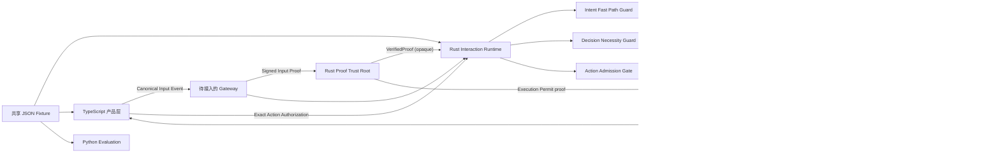

# The Human-Centered Intent & Decision Runtime V1：实现基线

状态：Foundation / shadow-mode vertical slice（可编译、可测试，外部审计结论仍为
`PRODUCTION TRUST ROOT = BLOCKED`）

## 1. 语言边界

| 层 | 语言 | 负责 | 明确不负责 |
| --- | --- | --- | --- |
| 语义、状态、裁决、治理、行动内核 | Rust | 规范化输入、确定性门禁、九类契约、运行状态、授权绑定、行动准入、追加式状态与失效传播 | UI 展示、模型实验、在客户端复制裁决逻辑 |
| 接入、协作、交互、产品 | TypeScript | 解析线协议、提交用户输入、展示运行结论、构造精确行动授权请求 | 判定 Fast Path、授予权限、提升 Human Model、直接执行 |
| 认知研究、模型实验、评估 | Python | 回放数据集、黄金样例评估、模型/Prompt 对比、安全回归指标 | 成为生产裁决源、绕过 Rust 门禁、写入长期用户模型 |

目标生产信任边界是 Rust。当前 Rust 实现尚未取得生产信任根资格；TypeScript 和
Python 仍只能消费或提出候选，不能重新解释、覆盖或跳过 Rust 的裁决。

## 2. 当前数据流



## 3. 已实现模块

### Rust

- `idr-protocol::human_centered`
  - `CanonicalInputEventV1`：一个事件可同时携带多个语义角色。
  - `Intent Fast Path Guard`：只有确定、参数完整、低影响、可逆且不依赖 Human Model 时才允许快路径。
  - `Decision Necessity Guard`：不确定时保守进入 Decision Runtime。
  - 九个核心对象：
    - Canonical Input Event
    - Human Model Assertion
    - Intent Contract
    - Decision Contract
    - Turn Coordination Plan
    - Response Contract
    - Action Contract
    - Execution Receipt
    - Outcome Record
  - `ExactActionAuthorizationV1`：授权绑定 Action 的精确 ID、修订号、记录摘要和参数摘要。
  - `RenderedResponseEnvelopeV1` + Response Admission：渲染结果绑定精确 Response Contract，并在发送前执行政策准入。
  - `Action Admission Gate`：确定性评估能力、双重权限、显式授权、参数、前置条件、
    政策、验证、补偿和依赖新鲜度；其中上游 facts 尚未全部升级为签名证明。
  - `SignedProofEnvelopeV1` / `VerifiedProofV1`：使用 Ed25519、固定二进制 signing
    bytes、pinned issuer/key，并要求调用方提供包含 subject ref/digest、tenant、scope、
    purpose 和 policy revision 的完整 expected binding；现有各 Admission 尚未全部强制
    消费 verified proof。
  - `ExecutionPermitRequestV1`：完整签名 Action/Authorization digest、provider、owner、
    attempt、lease、dispatch nonce、idempotency scope 与 policy revision。
  - `idr-store::issue_execution_permit`：在同一 Store 锁和 snapshot commit 中原子消费
    Proof ID、nonce 与 Authorization ID，并创建 Action 与
    tenant/operation/idempotency 唯一的 `ExecutionReservationV1`；旧 claim 生产入口
    已删除。
  - `ExecutionReservationV1`：保存完整 Permit 请求、Authorization、签名 Proof
    envelope、provider、owner、attempt、lease、delivery/dispatch/Receipt 状态；Store
    在锁内读取可信时钟，过期请求不能延迟消费，派发前丢失的 Permit 可以恢复。
  - `ExecutionReceiptV1`：绑定 Permit ID、Authorization、provider、owner、attempt
    和 dispatch nonce；只有已派发 Reservation 加经过 Ed25519 验证的 provider
    Receipt proof 才能提交，失败 attempt 可使用连续 attempt 编号重试。
  - `Human Model Update Gate`：认知服务只能形成候选；用户明确确认或真实结果证据才可晋级。
  - `InteractionRunStateV1`：显式合法状态迁移。
- `idr-runtime`
  - 将 Intent、Decision、Turn Coordination 三个确定性判断合并为一次运行评估。
  - 供应商比较示例得到 `unknown → required → respond_then_confirm_then_act → waiting_authorization`。
  - 定义持久 Orchestrator 所需的 Run/Step、Wait、Retry、Command 和 aggregate CAS
    repository 接口；当前尚无生产 scheduler 或 event loop。
- `idr-store`
  - 逻辑合约历史保留、原子 snapshot 替换、文件与目录同步、重启重放、幂等提交。
  - snapshot 具有单调 sequence、previous digest 和本地 append-only anchor，
    能检测单文件旧快照回滚与 anchor 丢失；它仍不是外部锚定的 immutable ledger。
  - anchor 以换行作为本地 commit marker，只能截断最后一个未完成 record；中间或
    已提交的损坏记录会硬失败。
  - 维护每个合约的 current pointer。
  - 上游修订替换后递归失效下游合约；重放时重新推导完整失效闭包。
  - 失效 identity 使用 `(contract kind, contract ID)`；不同 Kind 复用同一 UUID
    不能跳过依赖失效。

### TypeScript

- `@idr/interaction-client`
  - 对 Canonical Input 和 Rust 运行评估结果做线协议形状校验。
  - 拒绝 unknown fields、非法授权 decision 和已声明的 Assessment 跨字段矛盾。
  - 构造绑定精确 Action 修订与参数摘要的用户授权提交。
  - 不包含 Rust 门禁的客户端副本。

### Python

- `idr-evaluation`
  - 加载跨语言共享 fixture。
  - 对完整 Canonical Input 执行 UUID、引用、角色、unknown fields、wire 整数和版本校验。
  - 对 Rust 输出执行黄金结果比较。
  - 检测基础意图被个性化过程删除。
  - 检测用户要求确认时被错误跳过。

### 共享契约样例

- `contracts/human-centered/v1/fixtures/supplier-confirmation.json`
  - 同一份输入被 Rust、TypeScript、Python 三层共同使用，防止语义漂移。

## 4. 已固化的关键不变量

1. Base Intent 不可被 Human Model 删除，只能排序或追加个性化候选。
2. Fast Path 不能依赖 Human Model，也不能用于高影响或不可逆行动。
3. Decision Guard 返回 Unknown 时必须进入完整 Decision Runtime。
4. Response 必须经过渲染后政策检查。
5. 高影响 Action 不允许 `authorization_state = not_required`。
6. 高影响 Action 必须引用精确 Decision revision；store 重放 Decision 的自动化边界。
7. 用户授权只对一个精确 Action 修订、参数摘要和 Authority Context 有效；Action 改动后旧授权自动无效。
8. 所有合约内嵌的上游引用也必须出现在 metadata 的精确依赖集合中。
9. Execution Receipt 与 Action Contract 分离；Outcome 又与实际 Execution Receipt 分离。
10. 没有已派发 durable Execution Reservation 和 provider 签名 proof 的 Receipt
    不能写入 store。
11. 上游合约换版后，依赖旧版的 Response、Action、Receipt、Outcome 等会递归失效。
12. Python 模型输出与 TypeScript 产品逻辑都没有生产授权能力。
13. Decision 的 `UserDecided` 阶段必须记录选中项；定量 criteria 权重必须完整且
    合计 10,000 basis points。
14. Action parameters 和 Execution result payload 受字节、深度和节点预算约束。
15. 所有 V1 Turn 都必须计划 Response，Runtime 不得产生不可表示的 Plan 模式。
16. 任何不可逆 Action 都必须引用 Decision。
17. Aegis Authority 只能作为 Host candidate 进入未来 Authority Runtime。

## 5. 尚未实现

这次交付是可验证的内核基线，不代表 V1.3 已全部产品化。下一阶段仍需：

- 把聊天、API、事件流接入真实 Protocol Gateway。
- 接入 Context Fabric，并给上下文快照建立证据引用和时效策略。
- 实现受控的 Intent Resolution / Decision Runtime 模型调用与结构化解码。
- 把新合约写入现有 Audit Ledger / Trace Projection。
- 把 Capability Registry、双重 Authority 和现有 Execution Runtime 接到 Action Admission Gate。
- 将 Orchestrator 接口实现为持久 scheduler/event loop，并实现授权等待、过期、
  撤销、补偿、provider reconciliation 和结果未知处理。
- 将现有 Admission 改为只消费 `VerifiedProofV1`，并将 Permit 接入真实 Executor。
- 增加 Human Model 查询、用户查看/纠正/删除和长期存储策略。
- 实现 Outcome 观察调度、归因审查与更新候选生成。
- 通过宿主适配器将 TypeScript SDK 接入 Aegis Life 或其他产品；独立内核不依赖具体宿主应用。

## 6. 推荐实施顺序

1. Gateway + Context Snapshot + Rust runtime API。
2. 结构化 Intent / Decision provider port，并在 Rust 中验证其候选结果。
3. Contract Store 接入现有 durable evidence / audit substrate。
4. Action Admission 接入 Capability Registry 和 Production Authority。
5. Execution Receipt + Outcome 的真实业务闭环。
6. Human Model 的可见、可纠正产品体验。
7. 扩充 Python 离线集，形成发布前安全门槛。

## 7. 验证命令

```bash
cargo test -p idr-protocol --test idr_protocol_v1
cargo test -p idr-runtime
cargo test -p idr-store --test idr_store_v1
cargo check --workspace

cd packages/interaction-client
npm test
npm run typecheck

cd research/evaluation
PYTHONPATH=src python3 -m unittest discover -s tests -v
```
